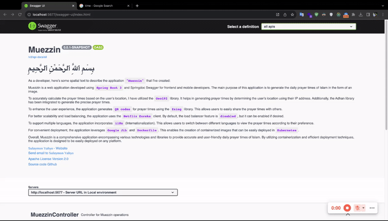

# Project Muezzin

As a developer, here’s some spatial text to describe the application `"Muezzin"` that I’ve created:<br><br>
Muezzin is a web application developed using `Spring Boot 3` and Springdoc Swagger for frontend and mobile developers. The main purpose of this application is to generate the daily prayer times of Islam in the form of an image.<br><br>
To accurately calculate the prayer times based on the user’s location, I have utilized the `GeoIP2` library. It helps in generating prayer times by determining the user’s location using their IP address. Additionally, the Adhan library has been integrated to generate the precise prayer times.<br><br>
To enhance the user experience, the application generates `QR codes` for prayer times using the `Zxing` library. This allows users to easily share the prayer times with others.<br><br>
For better scalability and load balancing, the application uses the `Netflix Eureka` client. By default, the load balancer feature is `disabled`, but it can be enabled if desired.<br><br>
To support multiple languages, the application incorporates `i18n` (Internationalization). This allows users to switch between different languages to view the prayer times according to their preference.<br><br>
For convenient deployment, the application leverages `Google Jib` and `Dockerfile`. This enables the creation of containerized images that can be easily deployed in `Kubernetes`.<br><br>
Overall, Muezzin is a comprehensive application encompassing various technologies and libraries to provide accurate and user-friendly daily prayer times of Islam. By utilizing containerization and efficient deployment techniques, the application is designed to be easily deployed on any platform.

## Prerequisites

- Java 17
- Maven

## Getting Started

1. Clone the repository:

```bash
   git clone https://github.com/your-username/your-project.git
```

2. Navigate to the project directory:

```bash
  cd your-project
```

3. Build the project using Maven:
```bash
  mvn clean install
```
4. Run the application:
```bash
  mvn spring-boot:run
```
5. Access the application in your browser:
```
  http://localhost:5677
```

#Configuration

If you want to use Netflix Eureka client for load balancing, you should change the eureka.client.enabled property to true in the application.yml file. By default, it is set to false. This will enable the Eureka client to register with the Eureka server for service discovery and load balancing.

To use Zipkin for distributed tracing, you should set the management.zipkin.tracing.endpoint property to the URL of your Zipkin server. Additionally, set tracing.enabled to true to enable tracing in your application. By default, it is set to false.

If you don't want to use Swagger documentation, you can disable it by setting springdoc.swagger-ui.enabled to false in the application.yml file. This will disable the Swagger UI endpoint and prevent the generation of Swagger documentation.

Please note that these configuration options may vary depending on your specific Spring Boot version and setup. Make sure to refer to the official documentation or relevant resources for accurate and up-to-date configuration details.

If you have any further questions or need assistance with specific configuration options, feel free to ask. 

#Usage



#Contributing

Explain how others can contribute to your project. Include guidelines for pull requests and code style.

#License

name: Apache License Version 2.0 <br>
url: https://www.apache.org/licenses/LICENSE-2.0

name: GeoLite2 License <br>
url: https://www.maxmind.com/en/geolite2/eula

#Contact

To reach out to me, you can contact me via email at `sulaymonyahyo@iloud.com` or `sulaymon1w@gmail.com`.
You can also visit my website at `sulaymonyahyo.com` for more information or to get in touch.
